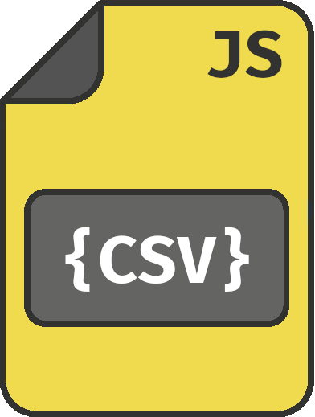

<p align="center">
  <a href="https://github.com/github_username/repo_name">
    
  </a>

  <h3 align="center">CSV Parser Js</h3>

  <p align="center">
    A lib to serialize CSV files into JSON objects.
  </p>
</p>

# Overview

- [Usage](#usage)
  - [handleInputChange](#handleInputChange)
  - [loadContent](#loadContent)
  - [toJson](#toJson)
  - [validateFields](#validateFields)
    <!-- - [Contribute](#contribute) -->
    <!-- - [How to run](#how-to-run) -->
- [License](#memo-license)

# Usage

Import the files, that you can find on `build/`, in your page, then you will be able to invoke `CSV`. It contains three methods you can use to handle your CSV files on browser

## **handleInputChange**

It's basically what you need to add on change event of your input element and it will return you the serialized file, it's not necessary to check if the input have files, but if you do not do it, the promise will be reject, so just treat the exception.

**Parameters**

```typescript
interface IParams {
  inputElement: HTMLInputElement;
  separator?: string; // default = ','
}
```

**Return type**

🕒 Promise

If the file is in blank, You will receive `undefined`, but if the file has a valid content you will receive an object in the following format:

```typescript
interface IResponse {
  filename: string;
  content: object[]; // the properties will follow the header found in this CSV file
}
```

## **loadContent**

This function and the other one 'toJson' are just exported in case you wish to validate by yourself the content or anything else before serialize.

**Parameters**

```typescript
interface IParams {
  csvFile: Blob | File;
}
```

**Return type**

🕒 Promise

This function returns the raw content as a string.

## **toJson**

This function and the other one 'toJson' are just exported in case you wish to validate by yourself the content or anything else before serialize.

**Parameters**

**csvContent**: The raw content of a CSV file.

```typescript
interface IParams {
  csvContent: string;
  separator?: string; // default = ','
}
```

**Return type**

This function returns an object with the serialized CSV and also the next function, witch gives You the possibility to check the columns of the collection.

```typescript
interface IResponse {
  serializedData: Array<{
    [key: string]: string | number;
  }>;
  validateFields: (
    expectedColumns: string[],
  ) => ValidateFields.IValidateFieldsResponse;
}

/* e.g:

Correct:
  [
    { id: 0, name: "Jhon Doe" },
    { id: 1, name: "Jhon Roe" }
  ]

X Incorrect:
  [
    { 9001 : "value" }
  ]
*/
```

## **validateFields**

This function validates if the serialized content has the specified fields.

**Parameters**

**csvContent**: The raw content of a CSV file.

```typescript
interface IParams {
  expectedColumns: string[];
  data: Array<{
    [key: string]: string | number;
  }>;
}
```

**Return type**

This function returns an object with the serialized CSV as the following:

```typescript
interface IResponse {
  isValid: boolean;
  error: Error | null;
  data: Array<{
    [key: string]: string | number;
  }>;
}
```

<!-- # How to run -->

## :memo: License

This project is under license MIT. See the file [LICENSE](LICENSE) for more details.
